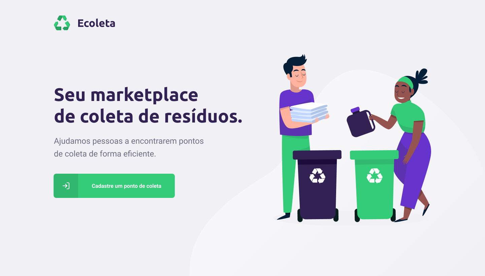

# ecoleta-app-nlw

## :computer: Projeto

Este projeto consiste na criação de uma aplicação cujo objetivo é funcionar como um marketplace entre empresas/organizações e pessoas para a coleta de resíduos recicláveis. Esta aplicação faz parte da semana **Next Level Week** promovida pela **Rocketseat**

## :rocket: Tecnologias

- Javascript / Typescript
- NodeJS
- ReactJS
- Reac Native

## :hammer: Backend

### Em construção

## :globe_with_meridians: Frontend

### Em construção

## :iphone: Mobile

### Em construção

## :memo: Licença

Projeto sob a licença [MIT](https://choosealicense.com/licenses/mit/)

Made by [Matheus Guedes](https://www.linkedin.com/in/matheusgsousa/)
